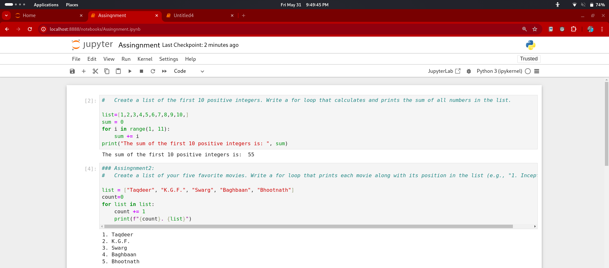
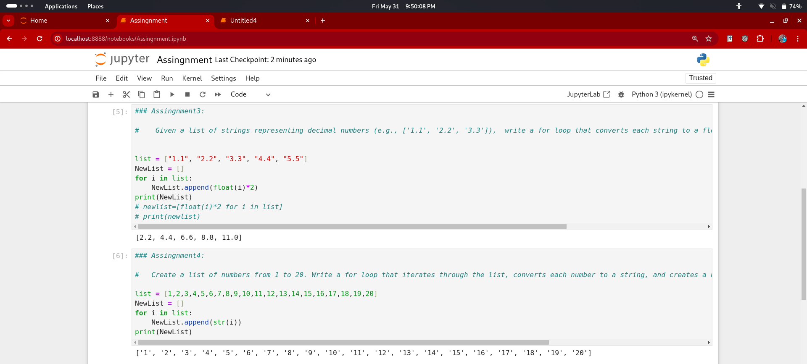
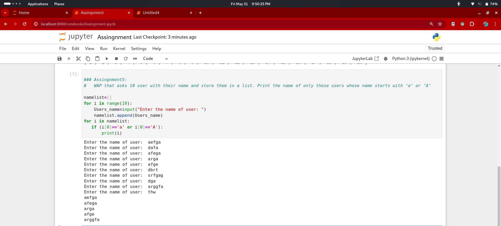
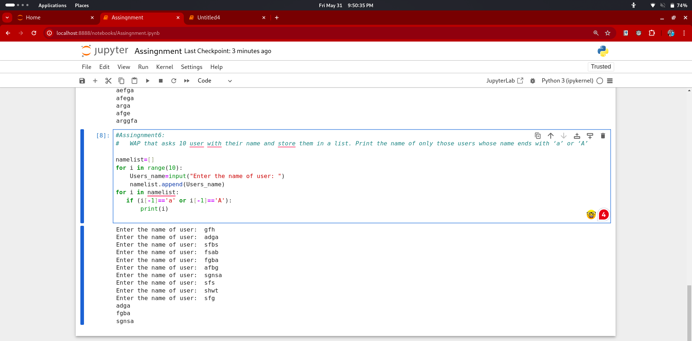

#  Assingnment1:
- 	Create a list of the first 10 positive integers. Write a for loop that calculates and prints the sum of all numbers in the list.
```bash
list=[1,2,3,4,5,6,7,8,9,10,]
sum = 0
for i in range(1, 11):
    sum += i
print("The sum of the first 10 positive integers is: ", sum)

```

### Screenshorts



### Assingnment2:
-	Create a list of your five favorite movies. Write a for loop that prints each movie along with its position in the list (e.g., "1. Inception").

``` bash
list = ["Taqdeer", "K.G.F.", "Swarg", "Baghbaan", "Bhootnath"]
count=0
for list in list:
    count += 1
    print(f"{count}. {list}")

```

### Assingnment3:

-	 Given a list of strings representing decimal numbers (e.g., ['1.1', '2.2', '3.3']),  write a for loop that converts each string to a float, doubles the value, and prints the result.

```bash
list = ["1.1", "2.2", "3.3", "4.4", "5.5"]
NewList = []
for i in list:
    NewList.append(float(i)*2)
print(NewList)
```

### Screenshorts


### OR
```bash
list = ["1.1", "2.2", "3.3", "4.4", "5.5"]
newlist=[float(i)*2 for i in list]
print(newlist)
```
### Assingnment4:

-     Create a list of numbers from 1 to 20. Write a for loop that iterates through the list, converts each number to a string, and creates a new list with these string values. Print the new list.

```bash
list = [1,2,3,4,5,6,7,8,9,10,11,12,13,14,15,16,17,18,19,20]
NewList = []
for i in list:
    NewList.append(str(i))
print(NewList)
```
### Assingnment5:
-	WAP that asks 10 user with their name and store them in a list. Print the name of only those users whose name starts with ‘a’ or ‘A’ 

```bash
namelist=[]
for i in range(10):
    Users_name=input("Enter the name of user: ")
    namelist.append(Users_name)
for i in namelist:
   if (i[0]=='a' or i[0]=='A'):
       print(i)
```

### Screenshorts



# Assingnment6:
-	WAP that asks 10 user with their name and store them in a list. Print the name of only those users whose name ends with ‘a’ or ‘A’

```bash
namelist=[]
for i in range(10):
    Users_name=input("Enter the name of user: ")
    namelist.append(Users_name)
for i in namelist:
   if (i[-1]=='a' or i[-1]=='A'):
       print(i)
```


### Screenshorts
